# Cafe Fuencarral
This website is designed for people in Bristol, whether residents or visitors, who are interested in enjoying Spanish tapas, perhaps for the first time. It shows users the different types of tapas dishes we offer on our menu and provides the option to book a table. Whether they're specifically seeking Spanish food or just looking for a  place to eat in Bristol, this website makes discovering tapas easy.

## User stories

### Customers

 - As a customer I want to book a table at a specific time and date so that I can guarantee a table at the cafe when I arrive.
 - As a customer I want to modify an existing reservation so that I can easily make changes.
 - As a customer I want to be able to cancel my reservation so that I can easily let the cafe know I won't be coming.
 - As a customer I want to safely share my name and email address so that they remain secure and inaccessible to other customers.
 - As a customer I want to be the only one to access my reservation so that other customers can't modify or cancel my booking.
 - As a customer I want to see the cafe's menu so that I know what food and drinks they have on offer.

### Restaurant Manager

 - As a restaurant manager I want to view reservations so that I know how many customers are arriving at a given time on a given day.
 - As a restaurant manager I want to see cancellations so that I can better service the cafe and other customers can book the new free slot.
 - As a restaurant manager I want to be the only one able to view all reservations so that customer details remain protected and other reservations stay confidential.

## Wireframes

I designed wireframes for both mobile and desktop using balsamiq in order to follow best practice. We worked on the mobile layout primarily as it is more likely that customers will view our reservation using their mobile device.

### Mobile

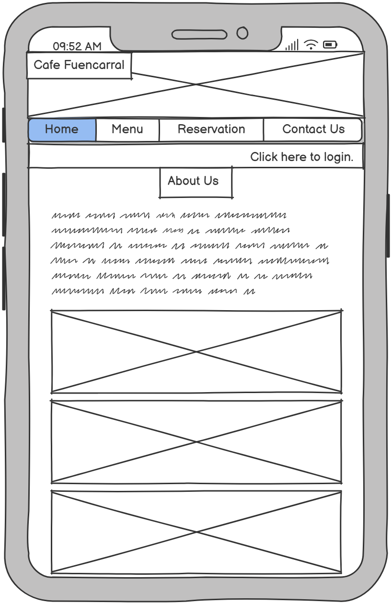

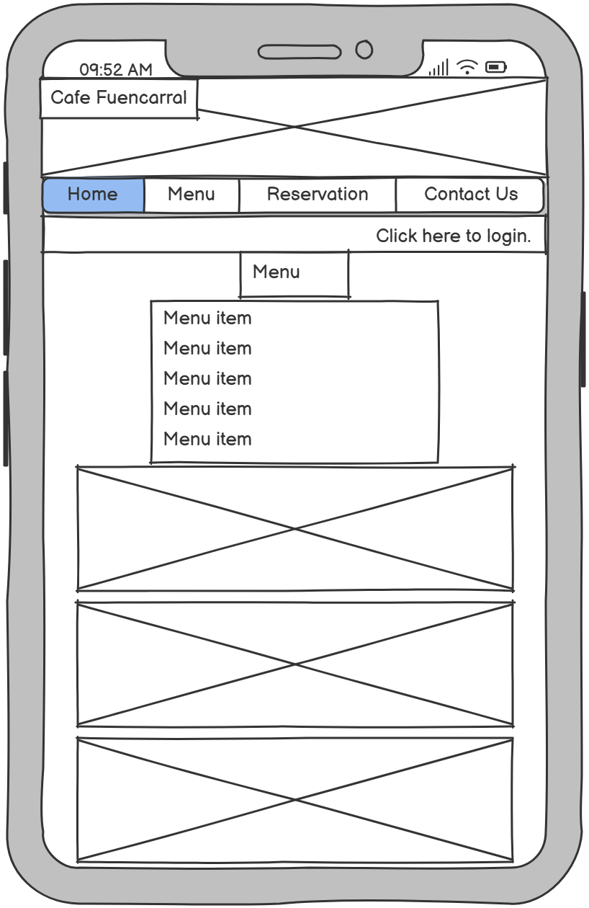

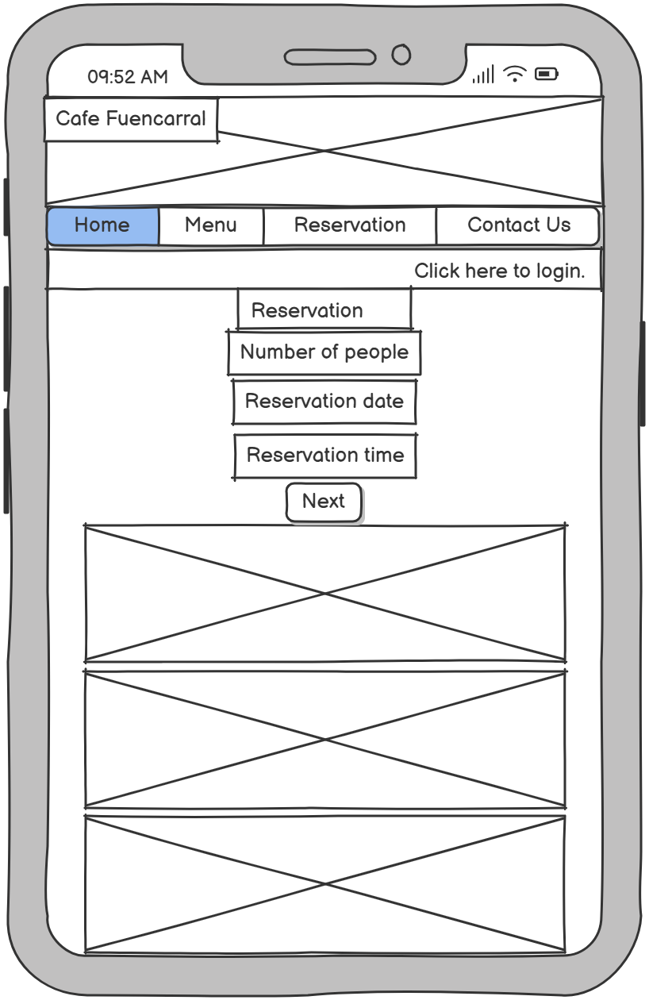

### Desktop

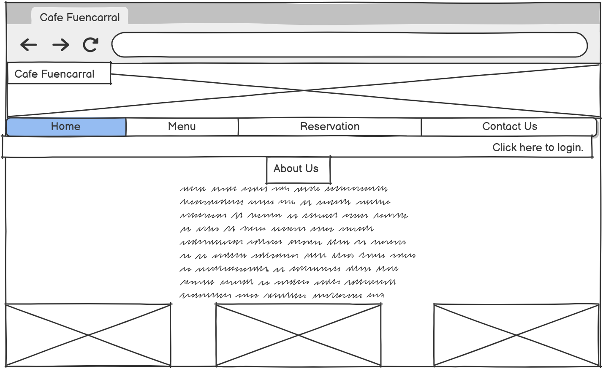

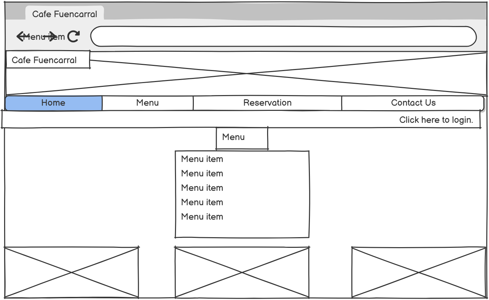

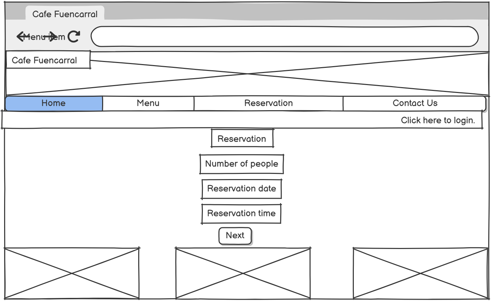

## Features

### Hero image and navbar

At the top of every page is the name of the cafe over a background image of some tapas. Directly below the image is the navbar, allowing for easy navigation around the entire website. Then there is some text asking the customer whether they would like to login to view their reservation which changes once they are logged in.

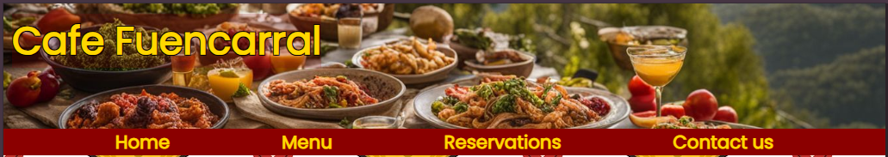

### Menu

There is a dedicated page for the menu where users can see the food and drinks we offer at the cafe. There is also a link at the bottom of this page that takes the user directly to the reservation screen where they can book a table.

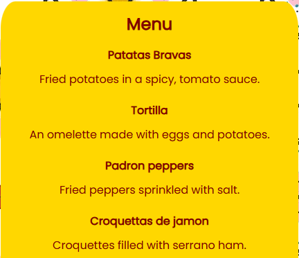

### Reservation part 1

The reservation form is split into two parts, so the customer can know for certain that their chosen time and date are available before they need to provide contact information. This enhances the user experience. Part 1 of the form asks for the date, time, and the number of people.

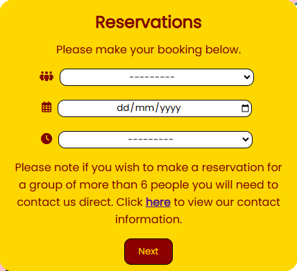

### Reservation part 2

Once the user selects an available time and clicks 'Next', they are taken to Part 2, where they are asked to enter their first and last name, email address and a password for their login. There is then a 'Submit' button to complete the reservation form.

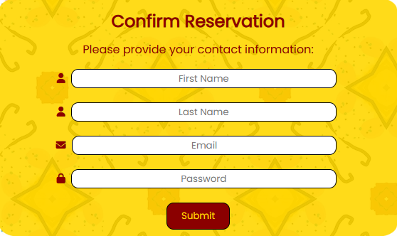

### Reservation confirmation

After clicking 'Submit,' the user is taken to the submission confirmation screen. Here, the user receives confirmation that their reservation was successful and is provided with the reservation details, allowing them to verify accuracy. They are also provided with a randomly generated code they can use to access their reservation. Finally, there is a link at the bottom of the screen where the user can go to modify or cancel their reservation.

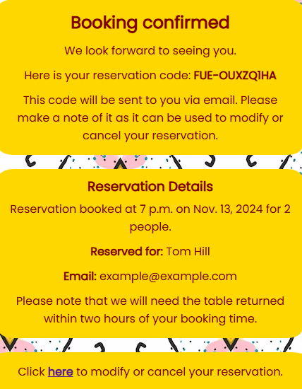

### Reservation search

If the user wishes to make changes to their reservation, they will first be taken to this screen, where they will need to login using the email address and password they provided as well as the randomly generated code they were given.

### Reservation details

After the user enters their code and login details and clicks 'Search', they will go to the details screen. Here, they will see details of their reservation along with two buttons: 'Modify' and 'Cancel.' 'Modify' will take them to another screen, while 'Cancel' will cancel the reservation.

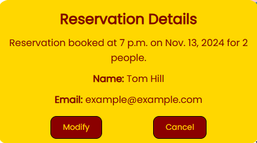

### Reservation modify

If the user clicks the 'Modify' button, they will be taken to this screen, where they can make changes to their reservation. Once they have made their changes, they can click the 'Update' button to save them.

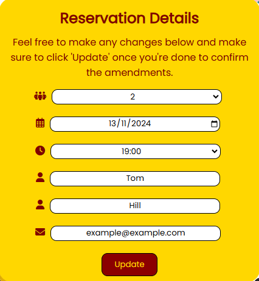

### Update confirmation

After clicking 'Update', the user will be taken to the next screen, where they will receive confirmation that the update has been successful.

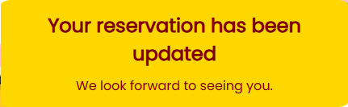

### Cancellation confirmation

On the modify screen, if the user clicks the 'Cancel' button, they will go to this screen, where they will see confirmation that their reservation has been cancelled.

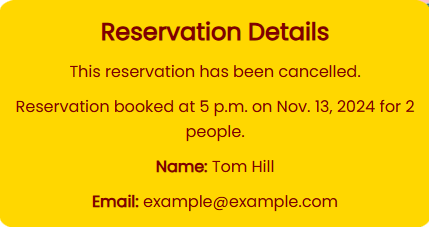

### Colour scheme

The two colours chosen for this website are dark red and gold, which nicely reflect the colours of the Spanish flag. A background image in the main section of every page also gives the website a more Spanish feel. The gold colour has been made slightly opaque so it is less intense and that way the Spanish themed background image comes through. 

### Navigation

Throughout the website, I have added links to other pages where appropriate to help with navigation. For example, after scrolling to the bottom of the menu page, I added a link to the reservation page, allowing the user to quickly jump to that page instead of scrolling back up to the top. Similarly, at the bottom of the homepage, if the user wants to learn more about what the cafe offers, there is a link to the menu page.

## Testing

### HTML

The code was put through the [W3C validator](https://validator.w3.org/#validate_by_input), and only one error was found where a '/' was placed in the wrong place in a paragraph tag. The error has been fixed.

### CSS

No errors were found when the CSS code was run through the [Jigsaw Validator](https://jigsaw.w3.org/css-validator/#validate_by_input)

### Python

The code was put through the [CI Python Linter](https://pep8ci.herokuapp.com/). The only errors were blank whitespaces and lines too long. All errors have been fixed.

### Manual testing

All the fields in the form are mandatory, so the form cannot be submitted without all fields being completed. This works for both Part 1 and Part 2 of the form and the search form, with an error message showing otherwise.

If the user selects a date in the past, an error message will let them know this date cannot be selected.

There are only **10 tables** in the cafe, so if all tables are already booked at a chosen time and date, an error message will show up after 'Next' is clicked, asking the user to select a different time. The user will also not be able to select a time within a two-hour window of a fully booked slot. For example, if there are 10 reservations at 5 pm, the next available reservation will be at 7 pm. Cancelled reservations do not count towards the 10 reservations. 

In Part 2 of the form, names and email addresses can still be submitted even if spaces are added at the front or end of entries. Submitting names or email addresses in all lowercase or all uppercase will convert them to the proper format. If an email is submitted in an incorrect format, an error message will prompt the correct format.

If the user inputs a password that is less than 6 characters long they are met with an error message informing them of the minimum requirment.

If the user searches with an incorrect code, they will receive an error message letting them know that the code does not exist. As above, codes submitted with spaces on either side are still accepted. Similarly, codes entered in lowercase are converted to uppercase.

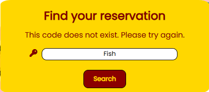

If the user enters the correct email address and code but the password is wrong they receive an error message informing them that the password they have provided is incorrect.

On the modify screen, if the user changes the time or date to a fully booked slot, they will receive an error message, as with a new reservation. If they select a date in the past, they will also receive an error message. If a customer has a reservation in a fully booked time slot, they can adjust their booking, such as moving it half an hour later. In this case, their original reservation will not be counted toward the maximum limit of 10 bookings for any time slot.

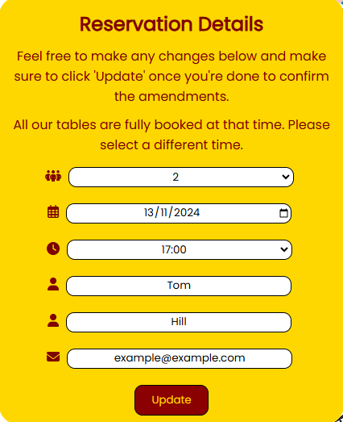

When searching for a reservation that has already been cancelled, a message will display on the details screen to let the user know.

Users are logged out automatically if they close their browser window while logged in. 

If the user trys to access step two of the reservation form without completing step one via the URL they will be  redirected to step one. Similarly if they try to acess the modify, details, cancel or update page without first entering the correct details in the search page via the URL they will be redirected to the search screen. Once the user is logged in if they click on the button to logout they will be redirected to the home page.

## Deployment

The website has been deployed through Heroku.

Steps taken for deployment:
 - Created a new app in Heroku.
 - Gave the app a unique name and chose the appropriate region.
 - Revealed the config vars and added the variables.
 - Linked the new app to the repository in GitHub.
 - Installed the `requirements.txt` and `Procfile`.
 - Added `web: gunicorn cafefuencarral.wsgi` to the `Procfile`.
 - Deployed the app.

## Accessibility

Running the homepage through Lighthouse shows there are no issues. The website was tested on both mobile and desktop, with very little variation in the scores on the other pages.

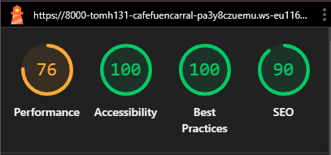
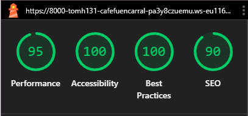

## Credits

### Content

 - The font was taken from [Google font](https://fonts.google.com/)
 - Website icon downloaded from [Favicon](https://favicon.io/)
 - The social media icons are from [Font Awesome](https://fontawesome.com/).

### Media

Images were taken from various website after searching in Google images
