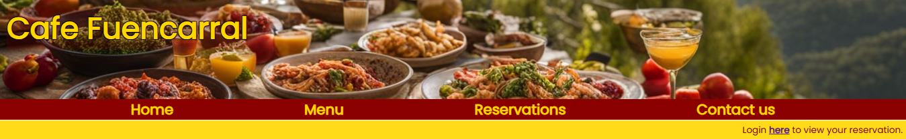
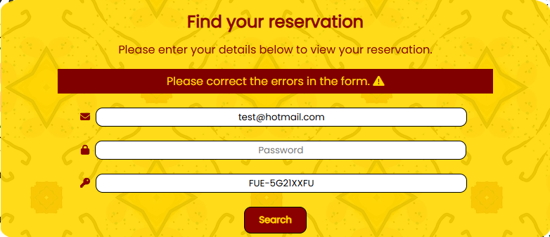

# Cafe Fuencarral
This website is designed for people in Bristol, whether residents or visitors, who are interested in enjoying Spanish tapas, perhaps for the first time. It helps users to see the different types of tapas dishes we offer on our menu and provides the option to book a table. Whether they're specifically seeking Spanish food or just looking for a  place to eat in Bristol, this website makes discovering tapas easy.

## Features

### Hero image and navbar

At the top of every page is the name of the cafe over a background image of some tapas. Directly below the image is the navbar allowing for easy navigation around the whole website.

### Menu

There is a page for the menu where users can see what food and drinks we have on offer at the cafe. There is also a link at the bottom of this page to take the user directly to the reservation screen where they can book a table.

### Reservation part 1

The reservation form has been split into two parts so the customer can know for certain that their chosen time and date is available before they need to provide their contact information. This will allow for a better user experience. 

Part 1 of the form asks for the date, time and how many people. All fields are mandatory so the user will not be able to continue until the form is completed. There are only 10 tables in the cafe so if we already have bookings at that time and date then an error message will show up after 'Next' is clicked and ask the user to select a different time. The user will also not be able to select a time within a two hour window of a fully booked slot. For example if we have 10 bookings at 5pm the next available booking will be 7pm.

If the user selects a date in the past an error message will show letting them know this date cannot be selected.

### Reservation part 2

Once the user selects an appropriate time and clicks 'Next' they are taken to part 2 where they are asked to enter their first and last name and their email address. Then there's a 'Submit' button to complete the reservation form. Again all fields are mandatory so the user will not be able to continue until the form is completed.

### Reservation confirmation

After clicking 'Submit' the user is taken to the submission confirmation screen. Here the user receives confirmation that their reservation was successful and they are provided with the details of the reservation where they can check everything is accurate. The user is also provided with a randomly generated code that they can use to access their reservation. Finally there is a link at the bottom of the screen where the user can go to modify or cancel their reservation. 

 FUE-OUXZQ1HA

### Reservation search

If the user wishes to make changes to their reservation they will first be taken to this screen where they will need to search for their reservation using the randomly generated code they were given. If the user uses an incorrect code they will receive an error message letting them know that the code used does not exist.

### Reservation details

After the user enters an existing code and clicks 'Search' they will go to the details screen. Here they will see details of their reservation along with two buttons, 'Modify' and 'Cancel'. Modify will take them to another screen and cancel will cancel the reservation. If the reservation has already been cancelled a message will show on the details screen to let the user know.

### Reservation modify

If the user clicks the 'Modify' button they will be taken to this screen where they are free to make any changes to their reservation. However if they change the time or date to a fully booked slot they will receive an error message, the same as before when making a new reservation. It is also the same here if they select a date in the past, they will receive an error message. Once they have made their changes they can click the 'Update' button to save their changes. 

### Update confirmation

After clicking 'Update' the user will be taken to the next screen where they will receive confirmation that the update has been successful.

### Cancellation confirmation

On the modify screen if the user clicks the 'Cancel' button they will go to this screen where they will see confirmation that their reservation has been cancelled.

## Testing

### HTML

### CSS

